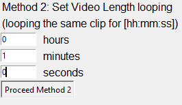
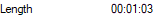

# Looping Clip Tool

## Description
A simple tool GUI to loop videos based either 
1. on number of loops or
1. time length   

Output is converted to the .mp4 format  
Available formats are: mp4, avi, wav, GIF
The best time render format is GIF

## Example
Selecting first the method, then choosing the output clip length  

Initial clip length  

Final clip length  
 (approx. 1 minute)

## License
his project is licensed unde MIT [https://opensource.org/licenses/MIT/]
