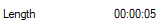

# Looping Clip Tool

## Description
A simple GUI app to loop videos based either 
1. on number of loops or
1. time length   

Output is converted to the .mp4 format  
Available formats are: mp4, avi, wav, GIF  
The best time render format is GIF

## Example
Selecting the clip final length and then proceed  

**Initial clip length**  
  
**Final clip length**  
 (approx. 1 minute)

## License
This project is licensed unde MIT [https://opensource.org/licenses/MIT/]
